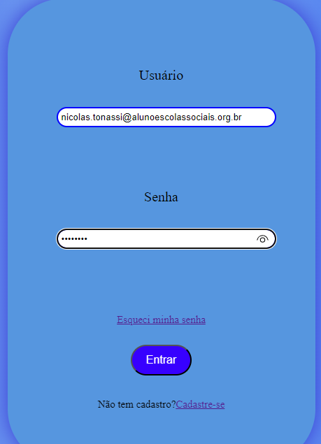

# Tela Login
 
* [Tela Login](#Tela-login)
* [Descrição](#descrição)
* [Introdução](#introdução)
* [Funcionalidades](#funcionalidades)
* [Tecnologias Utilidades](#tecnologias-utilizadas)
* [Autores](#autores)
 
# Tela Login
 
## Descrição 📖
- O projeto consiste em uma tela de login desenvolvida em JavaScript, HTML5 e CSS3 para a empresa Alpha. O objetivo é criar uma aplicação que permita o acesso por meio de tela de login, com campos para usuário, senha, cadastro e recuperação de senha. A aplicação também inclui a validação dos campos de acesso, com mensagens de erro para campos obrigatórios. Além disso, há uma página para recuperação de senha, que permite ao usuário informar seu e-mail para recuperação (mesmo que a etapa de recuperação em si não precise ser implementada).

 
## Introdução ✉️
- A empresa Alpha está expandindo suas operações e busca um(a) programador(a) trainee para integrar sua equipe de TI própria. O desafio consiste em desenvolver uma tela de login funcional que atenda às necessidades da empresa e dos usuários.

 
## Funcionalidades 🧠
- Desenvolvimento de tela de login interativa
- Campos para usuário, senha, cadastro e recuperação de senha
- Validação dos campos de acesso (JavaScript)
- Página para recuperação de senha
- Interface amigável e responsiva, desenvolvida com HTML5 e estilizada com CSS3.
 
## Tecnologias Utilizadas 🖥️  
- Visual Studio Code;
- CSS3;
- Github;
- Git;
- HTML5;
- JavaScript.
 
## Autores 👥
- Github: [Nicolas Tonassi](https://github.com/nicolas-tonassi); LinkedIn: [Nicolas Tonassi](https://www.linkedin.com/in/nicolas-tonassi-b70a50261?utm_source=share&utm_campaign=share_via&utm_content=profile&utm_medium=android_app)
- [Murilo Tonassi](https://github.com/murilo-tonassi)
- [Pamela Souza](https://github.com/PamelaSouzaSilva)